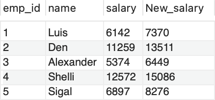

# Find Customer Referee
Write an SQL query to fetch the names of the customer that are not referred by the customer with id = 102.

Table: customer


Sample Input:


Sample Output:


Explanation: Only customers Gwenneth and Daryl are referred with id=102

```sql
SELECT name from customer where referee_id <> 102;
```

# Find Customers With Positive Revenue this Year
Write an SQL query to report the unique customers with postive revenue in the year 2021.

Table: Customers


Sample Input:


Sample Output:


Explanation: Only customer_id 100 has positive revenue in the year 2021

```sql
SELECT DISTINCT customer_id from customers where revenue >= 0 AND year=2021;
```

# New Salary
Problem Description:

Write a query to calculate the salary of all employees after an increment of 20%. Save the newly calculated salary column as 'New_salary'.

Table: employees


Note:

* Return the columns emp_id, name, salary, and 'New_salary'.
* Order the output by the emp_id in ascending order.

Steps to calculate the salary increment:

* Multiply the current salary by the percentage of the increment.
* Divide the result by 100.
* Then add the result to the current salary.
* Name the column as 'New_Salary'
* Round off the 'New_salary'.

Sample Input:

Table: employees


Sample Output:




Explanation: The New salary for Luis can be calculated as 6142+(0.2*6142) = 7370. In a similar manner, the New_salary is calculated for each employee.

```sql 
select emp_id, name, salary, (ROUND(salary+salary*0.2)) as New_salary from employees;
```

# Total Amount

Problem Description:

Write a query to calculate the sub_total for each order, return the details of the orderNumber, productCode, and sub_total.

Table: orderdetails


Note:

* Round off the sub_total up to two decimal places.
* Order the output by the orderNumber in ascending order and then by sub_total in descending order.

Sample Input:

Table: orderdetails


Sample Output:


Sample Explanation:

To get the sub_total for each orderNumber, we must multiply the quantityOrdered column with the PriceEach column.

```sql
SELECT orderNumber, productCode, ROUND(quantityOrdered*priceEach, 2) as sub_total 
from orderdetails
order by orderNumber, sub_total desc;
```

# Employee 101

Problem Statement:

Write a query to get all the details of all the employees from job_history except for the employee with id 101

Return all the fields.
Return the result ordered by employee_id and job_id in ascending order.

Table: job_history


Sample Input:


Sample output:


Explanation: The above table shows all the employees which do not have an employee_id 101 and is ordered by employee_id and job_id in ascending order.

```sql
select * from job_history
where employee_id <> 101
order by employee_id, job_id;
```

# Movies released after 2014

Problem Statement:

Write a query to display the titles of the movies that are released (i.e., release_year) after 2014 and have an average vote rating (i.e.,vote_average) greater than 7.

Return the column 'original_title'.
Return the result ordered by original_title in ascending order.
Dataset description for movies table:

1) id - tmdb movie id

2) imdb_id - imdb movie id

3) popularity -A numeric quantity specifying the movie's popularity.

4) budget -The budget in which the movie was made.

5) revenue - The worldwide revenue generated by the movie.

6) original_title- The title of the movie

7) cast - The name of the lead and supporting actors.

8) homepage - A link to the homepage of the movie.

9) director - The name of the director of the movie

10) tagline - Movie's tagline.

11) keywords -The keywords or tags related to the movie.

12) overview -A brief description of the movie.

13) runtime -The running time of the movie in minutes.

14) genres -The genres of the movies

15) production_companies-The production house of the movie.

16) release_date -the date on which it was released.

17) vote_count -the count of votes received.

18) vote_average - average ratings the movie received.

19) release_year - the year on which it was released.

Sample Input:

Table: movies


Sample Output:


```sql
select original_title
from movies
where release_year > 2014 and vote_average > 7
order by original_title;
```

# Selected Departments

Problem Statement:

Write a query to find the details of those employees who work in the departments with numbers included in 30, 40, or 90.

Return the result ordered by employee_id in ascending order.
Table: employees


Sample Input:

Table: employees


Sample output:


Explanation: The above employees have department_id included in 30, 40, or 90.

```sql 
select employee_id, first_name, job_id, department_id
from employees
where department_id in (30, 40, 90)
order by employee_id;
```

# Office Codes

Problem Statement:

Write a query to find the employees whose officeCodes are not included in 4,6,7.

Return the result ordered by firstName and lastName in ascending order.
Table: employees


Sample Input:

Table: employees


Sample output:


Explanation: The above table shows the employees whose office codes are not 4,6 or 7.

```sql 
SELECT firstName, lastName, jobTitle
from employees
where officeCode not in (4,6,7)
order by firstName, lastName;
```

# Horror genre

Problem Statement:

Display the details of the movies which belong to the 'Horror' genre.

Return the columns 'original_title', and 'popularity'.
Return the result ordered by the popularity in descending order.
Dataset description for movies table:

1) id - tmdb movie id

2) imdb_id - imdb movie id

3) popularity -A numeric quantity specifying the movie's popularity.

4) budget -The budget in which the movie was made.

5) revenue - The worldwide revenue generated by the movie.

6) original_title- The title of the movie

7) cast - The name of the lead and supporting actors.

8) homepage - A link to the homepage of the movie.

9) director - The name of the director of the movie

10) tagline - Movie's tagline.

11) keywords -The keywords or tags related to the movie.

12) overview -A brief description of the movie.

13) runtime -The running time of the movie in minutes.

14) genres -The genres of the movies

15) production_companies-The production house of the movie.

16) release_date -the date on which it was released.

17) vote_count -the count of votes received.

18) vote_average - average ratings the movie received.

19) release_year - the year on which it was released.

Sample Input:

Table: movies


Sample Output:


```sql
select original_title, popularity
from movies
where genres='Horror'
order by popularity desc;
```