# Top 5 popular movies

Problem Statement:

Find the movie titles, taglines, and directors for the top 5 popular movies.

Return the columns 'original_title', 'tagline', and 'director'.
Dataset description for movies table:

1) id - tmdb movie id

2) imdb_id - imdb movie id

3) popularity -A numeric quantity specifying the movie's popularity.

4) budget -The budget in which the movie was made.

5) revenue - The worldwide revenue generated by the movie.

6) original_title- The title of the movie

7) cast - The name of the lead and supporting actors.

8) homepage - A link to the homepage of the movie.

9) director - The name of the director of the movie

10) tagline - Movie's tagline.

11) keywords -The keywords or tags related to the movie.

12) overview -A brief description of the movie.

13) runtime -The running time of the movie in minutes.

14) genres -The genres of the movies

15) production_companies-The production house of the movie.

16) release_date -the date on which it was released.

17) vote_count -the count of votes received.

18) vote_average - average ratings the movie received.

19) release_year - the year on which it was released.

Sample Input:

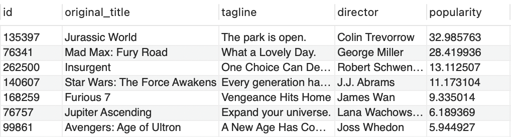


Sample Output:

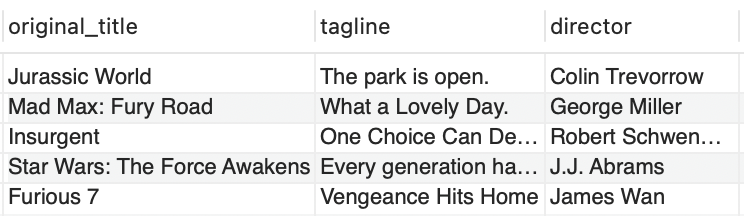

```sql
select original_title, tagline, director
from movies
limit 5;
```

# Low Fat & Recyclable Products

Problem Statement:

Write a query to find the ids of products that are both low-fat and recyclable.

Return the result table ordered by product_id in ascending order.
Table: products

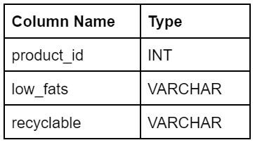

Sample Input:

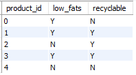


Sample output:


Explanation:

Only products 1 and 3 are both low-fat and recyclable.


```sql
select product_id
from products
where low_fats='Y' and recyclable='Y'
order by product_id;
```

# Germany

Problem Statement:

Write a query to fetch customer details like customerName, phone, addressLine1, city, state, and postalCode who are not from Germany.

Return the result ordered by customerName in ascending order.
Table: customers

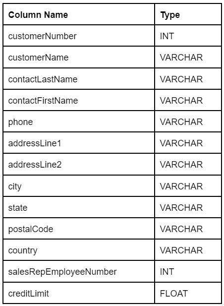

Sample Input:

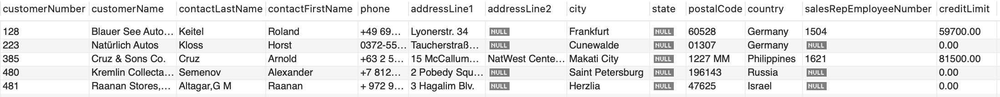


Sample output:

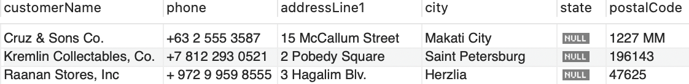

```sql

select customerName, phone, addressLine1 as addressline1, city, state, postalCode as postalcode
from customers
where country <> 'Germany'
order by customerName;
```

# Patients With a Condition

Write an SQL query to report the patient_id who have Type I Diabetes. Type I Diabetes always starts with DIAB1 prefix.

Table: patients

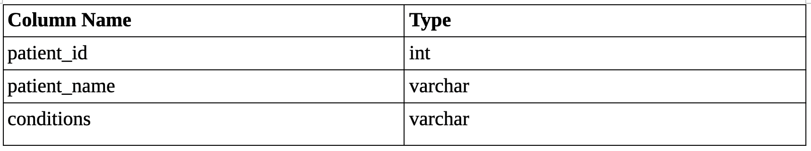

Sample Input:

Table: patients


Sample Output:


Explanation: Patients with id 10 and 12 have Type I Diabetes as conditions have words having 'DIAB1' as prefix

```sql
select patient_id 
from patients
where conditions like '% DIAB1%' or conditions like 'DIAB1%';
```

# 2012-2015

Problem Statement:

Find the details of the movies that are released between the years 2012-2015 i.e., (Including 2012 and 2015).

* Return the columns 'original_title', 'genres', 'vote_average', and 'revenue'.
* Return the result ordered by original_title in ascending order.

Dataset description for movies table:

1) id - tmdb movie id

2) imdb_id - imdb movie id

3) popularity -A numeric quantity specifying the movie's popularity.

4) budget -The budget in which the movie was made.

5) revenue - The worldwide revenue generated by the movie.

6) original_title- The title of the movie

7) cast - The name of the lead and supporting actors.

8) homepage - A link to the homepage of the movie.

9) director - The name of the director of the movie

10) tagline - Movie's tagline.

11) keywords -The keywords or tags related to the movie.

12) overview -A brief description of the movie.

13) runtime -The running time of the movie in minutes.

14) genres -The genres of the movies

15) production_companies-The production house of the movie.

16) release_date -the date on which it was released.

17) vote_count -the count of votes received.

18) vote_average - average ratings the movie received.

19) release_year - the year on which it was released.

Sample Input:

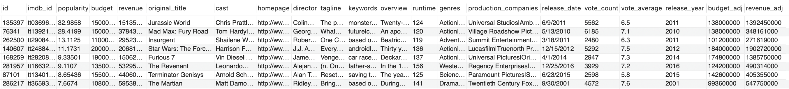


Sample Output:

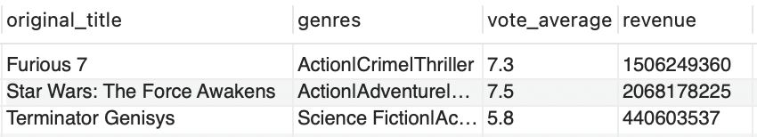


```sql
select original_title, genres, vote_average, revenue
from movies
where release_year between 2012 and 2015
order by original_title;
```

# Olympic Table

Problem Statement:

Write a SQL query to sort the olympic table according to the following rules:

* The country with more gold medals should come first.
* If there is a tie in the no. of gold medals, the country with more silver medals should come first.
* If there is a tie in the no. of silver medals, the country with more bronze medals should come first.
* If there is a tie in the no. of bronze medals as well, then the countries with the tie are sorted in ascending order lexicographically.

Table: olympic

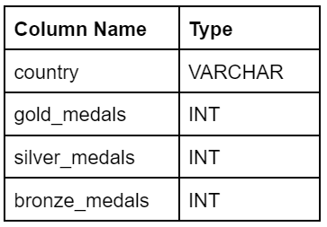

Sample Input:

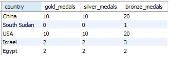


Sample output:

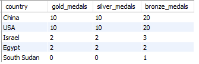

Explanation:

* The tie between China and USA is broken by their lexicographical names.
* Since "China" is lexicographically smaller than "USA", it comes first.
* Israel comes before Egypt because it has more bronze medals.

```sql
select * from olympic
order by gold_medals desc, silver_medals desc,bronze_medals desc, country;
```

# Keywords

Problem Statement:

Write a query to list down all the movies along with their details that have keywords like 'sport' or 'sequel' or 'suspense'.

Note:

Return the columns 'original_title', 'director', 'genres', 'cast', 'budget', 'revenue', 'runtime', and 'vote_average'.
Return the columns ordered by original_title in ascending order.
Dataset description for 'movies' table:

id - tmdb movie id
imdb_id - imdb movie id
popularity - A numeric quantity specifying the movie popularity.
budget - The budget in which the movie was made.
revenue - The worldwide revenue generated by the movie.
original_title - The title of the movie
cast - The name of the lead and supporting actors.
homepage - A link to the homepage of the movie.
director - The name of the director of the movie
tagline - Movie tagline.
keywords - The keywords or tags related to the movie.
overview - A brief description of the movie.
runtime - The running time of the movie in minutes.
genres - The genres of the movies
production_companies - The production house of the movie.
release_date - the date on which it was released.
vote_count - the count of votes received.
vote_average - average ratings the movie received.
release_year - the year in which it was released.
Sample Input:

Table: movies

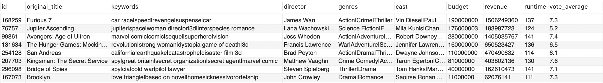

Sample output:

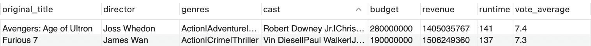

```sql
select original_title, director, genres, cast, budget, revenue, runtime, vote_average
from movies
where keywords like '%sport%' or keywords like '%sequel%' or keywords like '%suspense%'
order by original_title;
```

# Cities starting with vowels

Problem Statement:

Write a query to get the list of city names starting with vowels (i.e., a, e, i, o, or u) from station table.

The result should not contain duplicate values.

* Return the result table ordered by city in ascending order.

Table: station

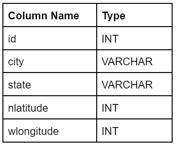

Sample Input:

Table: station

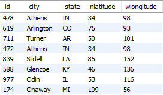

Sample output:

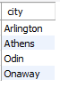

Explanation: The above table has unique city names starting with vowels (i.e., a, e, i, o, or u) and is ordered by city in ascending order.

```sql
select distinct city
from station
where city like 'a%' or city like 'e%' or city like 'i%' or city like 'o%' or city like 'u%'
order by city;
```

# Problems that are low quality

Problem Statement:

Write a query to report the IDs of the low-quality problems.

A problem is low-quality if the like percentage of the problem (the number of likes divided by the total number of votes) is strictly less than 60%.

* Return the result table ordered by problem_id in ascending order.

Table: problems

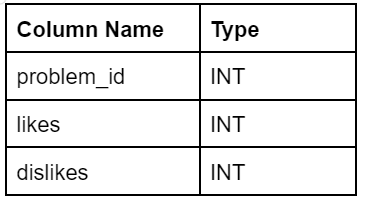

Sample Input:

Table: problems

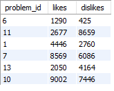

Sample output:

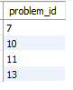

Explanation:

The like percentages are as follows:

* Problem 1: (4446 / (4446 + 2760)) * 100 = 61.69858%
* Problem 6: (1290 / (1290 + 425)) * 100 = 75.21866%
* Problem 7: (8569 / (8569 + 6086)) * 100 = 58.47151%
* Problem 10: (9002 / (9002 + 7446)) * 100 = 54.73006%
* Problem 11: (2677 / (2677 + 8659)) * 100 = 23.61503%
* Problem 13: (2050 / (2050 + 4164)) * 100 = 32.99002%
* Problems 7, 10, 11, and 13 are low-quality problems because their like percentages are less than 60%.

```sql
select problem_id
from problems 
where (likes*100/(likes+dislikes)) < 60;
```